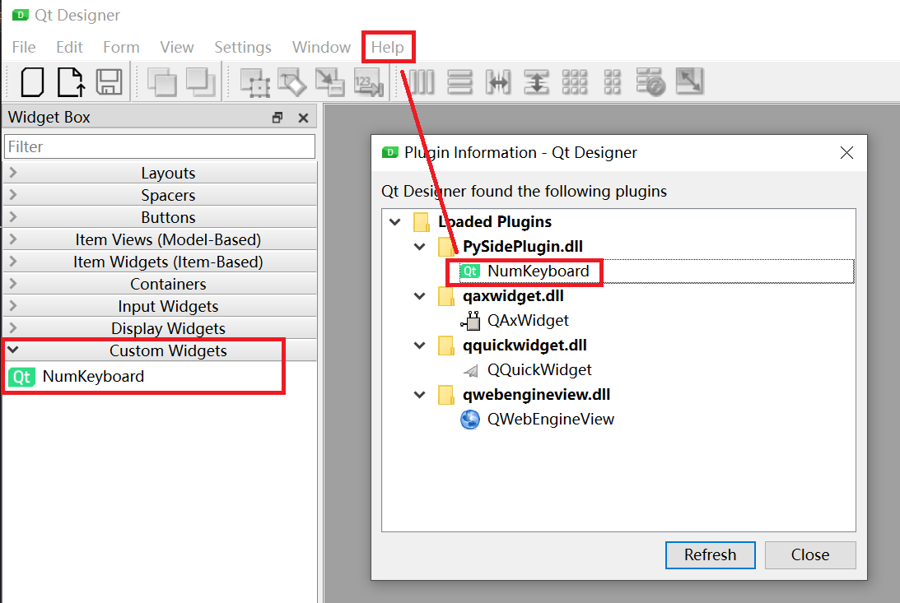

## How to add a Custom Widget
1. create a new DIR named `Name_Of_New_Custom_Widget` in current path and change path to it;
2. design the custom widget UI by `pyside6-designer`. After finish the design, you can get the `*.ui` file, like [`NumKeyboard.ui`](./NumKeyboard/NumKeyboard.ui);
3. compile the `*.ui` to `*_ui.py` by `pyside6-uic`:
- if step1 used other resources, like images, in `*_ui.py` should have `import *_rc` line, edit as below:
```
try:
    import xxx_rc
except:
    from . import xxx_rc
``` 
4. finish the custom widget's build-in functions and the `registerToDesigner` function, like [NumKeyboard.py](./NumKeyboard/NumKeyboard.py);
5. finish the simple test example, like [test_NumKeyboard.py](./NumKeyboard/test_NumKeyboard.py)
6. return to the upper-level folder, test the new custom widget by:
```bash
# test the custom widget function
python -m NameOfWidget.test_NameOfWidget

# test the register
$env:PYSIDE_DESIGNER_PLUGINS="/path/to/register*.py"    # add Env Variable in PowerShell
pyside6-designer    # you should see your new custom widget in Designer's Widget Box
```

## How to use (Include all the plugins to Designer)
1. clone this repo;
2. compile the `*_ui.py` and `*_rc.py` file in __each sub-folder__:
```bash
# for example: compile the NumKeyboard 
cd NumKeyboard
pyside6-uic NumKeyboard.ui -o NumKeyboard_ui.py

# !!! edit NumKeyboard_ui.py: "import resources_rc" to
"""
try:
    import resources_rc
except:
    from. import resources_rc
"""

pyside6-rcc resources.qrc -o resources_rc.py
cd ..
```
3. test the widget:
```bash
# for example: test the NumKeyboard
# solution 1:
python -m NumKeyboard.test_NumKeyboard      # can NOT use relative path

# solution 2:
cd NumKeyboard
python test_NumKeyboard.py
cd ..
```
4. set Environment Variable __`PYSIDE_DESIGNER_PLUGINS`__ to the __dir__ include [registerPlugins.py](./registerPlugins.py):
```bash
# power shell
$env:PYSIDE_DESIGNER_PLUGINS="/path/to/DIR/include/registerPlugins.py"
```
5. run `pyside6-designer` to use the custom widget.

## DEBUG
1. run `python registerPlugins.py`, this should only output something as below:
```bash
class QPyDesignerCustomWidgetCollection *__cdecl QPyDesignerCustomWidgetCollection::instance(void): Cannot find QCoreApplication instance.
```
2. In `Qt Designer`, the menu `Help --> About Plugins` should see the custom widget:

